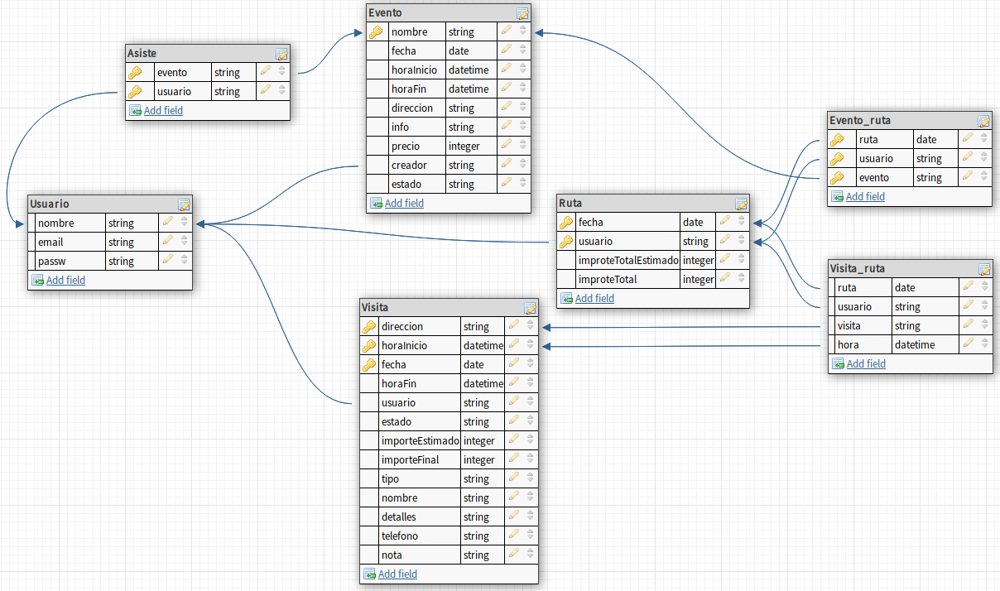
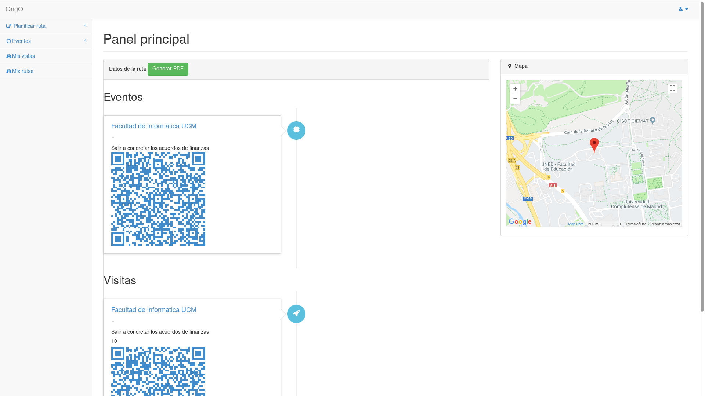
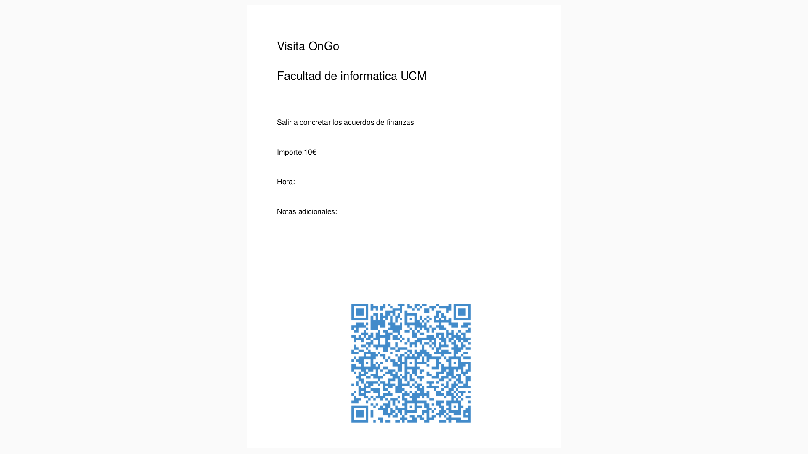

OngO
====

Integrantes
-----------

*   Javier Martín Villarreal

Proyecto
--------

OngO es una web para gestionar tus rutas: visitas a tus clientes, a museos, rutas turísticas compartidas con amigos, todo esto y mas con las facilidades de escanear los destinos con códigos QR y poder generar y descargar detalladamente PDF con los QRs que dirigen a Google Maps.

El desarrollo del proyecto se puede seguir en el siguiente [repositorio](https://github.com/javimv36/iw-base).

Vistas
------

Detalla aquí tus vistas. Usa enlaces a localhost:8080/ (SIN nombre de proyecto; correspondientes a arrancar la aplicación en modo spring-boot desde STS) para enlazar cada vista.

*   [vista principal](localhost:8080/) \- Muestra la próxima ruta a realizar y e mapa con la misma
*   [Ver visita](localhost:8080/visita) \- Muestra los detalles de una sola visita
*   [Crear visita](localhost:8080/crear_visita) \- formulario de creación de una visita
*   Crear evento \- en esta vista se muestra un formulario para la creación de un evento.
*   Crear ruta \- mustra las visitas y los eventos creados y aquellos a los que asistirá el usuario para poder elegirlos en una misma ruta.
*   Ver eventos creados \- Muestra los eventos creados por el usuario.
*   Asistencia a eventos \- Muestra los eventos a los que asistirá el usuario.
*   Ver evento \- Muestra un evento, el evento se define en la URL como /evento/\[id\]
*   Ver ruta \- Muestra una ruta, la ruta se define en la URL como /ruta/\[id\]
*   Crear evento \- Página de creación de un evento.
*   Ver eventos disponibles \- pagina que muestra un listado de todos los eventos.
*   Mis rutas \- Página que muestra un listado con las rutas creadas por el usuario.
*   Mis visitas \- Página que muestra un listado con las visitas creadas por el usuario.

Recursos
--------

Los recursos que voy a utilizar son:

*   [gmaps.js](#) \- Librería para mostrar rutas de mapas, obtener direcciones y obtener coordenadas.
*   [JQuery](https://code.jquery.com/jquery-3.1.1.min.js) ([MIT/Apache](https://jquery.org/license/)) \- librería js para simplificar la aplicación de comportamientos
*   [qrcode.js](https://davidshimjs.github.io/qrcodejs/) \- librería para generar codigos qr
*   [jsPDF.js](http://manuels.github.io/jsPDF.js/) \- liberia para compilar el código latex y generar los pdfs

 

---

#FORKED FROM

# iw-base

Proyecto base para [IW 2017-18](https://cv4.ucm.es/moodle/course/view.php?id=96754)

El uso de este proyecto como base es opcional (cualquier aplicacin que use Spring MVC, JPA para persistencia y Spring Security para autenticación y roles es admisible) - pero es muy recomendable.

## Contenido
- `src` : fuentes, incluyendo
- `src/main` : fuentes reales, excluyendo ficheros que sólo se usan en las pruebas
- `src/main/webapp` : plantillas JSP y fragmentos de plantilla (JSPFs)
- `src/main/java` : base de los ficheros java que componen el controlador, el modelo, y la configuracin de la aplicacin.
- `src/main/resources` : ficheros no-fuente de la aplicación
- `src/main/resources/application.properties` : propiedades generales de la aplicación, en formato clave-valor
- `src/main/resources/import.sql` : valores a cargar en una BD recién inicializada
- `src/main/resources/static` : raiz donde encontrar los ficheros estáticos (JS, CSS, imágenes) de la aplicación. Contiene versiones de Bootstrap y JQuery, cuyo uso es completamente opcional.
- `pom.xml` : fichero de proyecto. Cambia tu groupId / artifactId para que sea tuyo y original. Permite compilar, probar y desplegar tu proyecto vía [Maven](https://maven.apache.org/); y se puede importar a Eclipse / STS vía `importar > proyecto maven con fuentes existentes`
- `leeme.html` : fichero de "leeme.html" de ejemplo. Úsalo como plantilla para preparar tus entregas.

## Ficheros de aplicación y ficheros de usuario

No se debe incluir contenido "de usuario" en `src/main/resources` - esta carpeta es de sólo lectura mientras la aplicación está desplegada. Para guardar y servir ficheros de usuario, se debe seguir el mecanismo descrito en 
[LocalData](https://github.com/manuel-freire/iw-base/tree/master/src/main/java/es/ucm/fdi/iw/LocalData.java)
